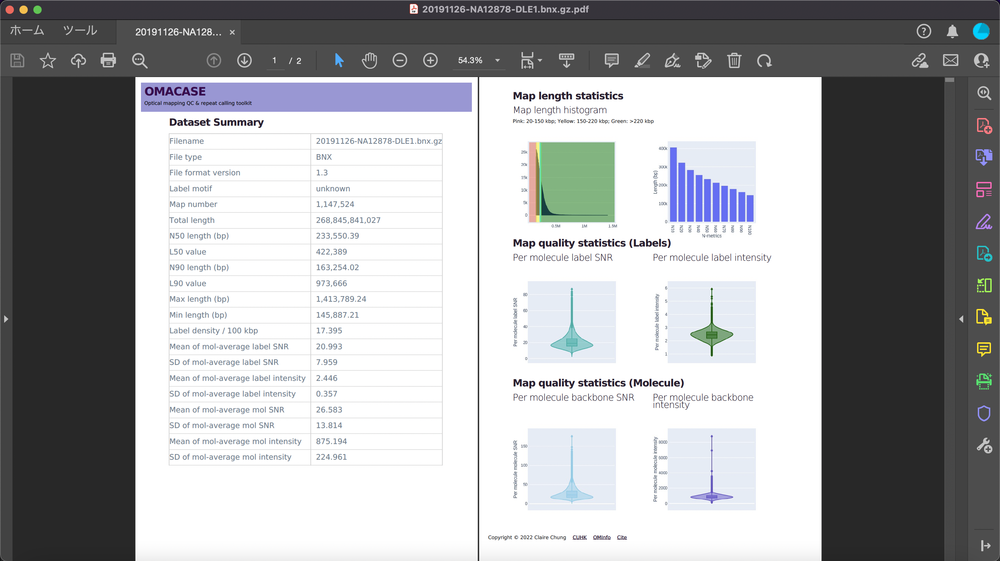
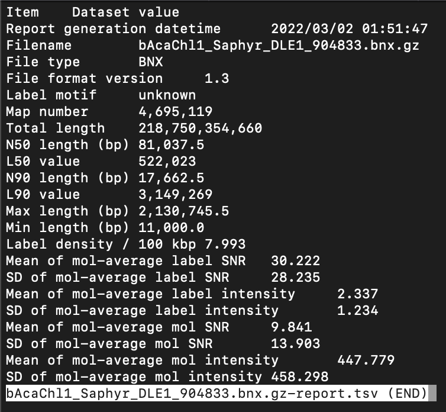

# Viewing a QC report

OMACASE supports QC report generation for both BNX molecule files and CMAP consensus map files.
GZ compressed files are also supported.

## View the QC report on browser
- `python3 -m omacase -m report -i {input_filepath}`
- Go to `localhost:8050` on a web browser
- The web app can be served at a custom port by adding the `-p {port}` option

## Print a PDF file of the QC report
- `python3 -m omacase -m report -i {input_filepath} -f pdf`

```{note}
Depending on the computer environment, adjustment of CSS template 
`{OMACASE}/assets/css/01_omacase.css` may be needed for the best printing layout
```



## Generate a tabular plain text simple report
- `python3 -m omacase -m report -i {input_filepath} -f tsv`


