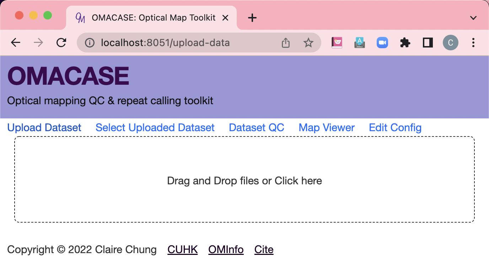
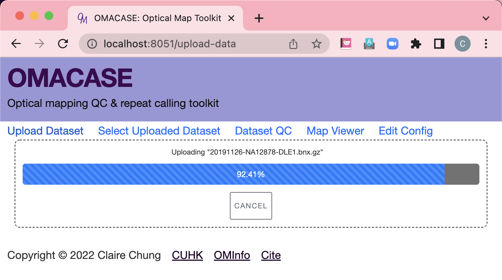
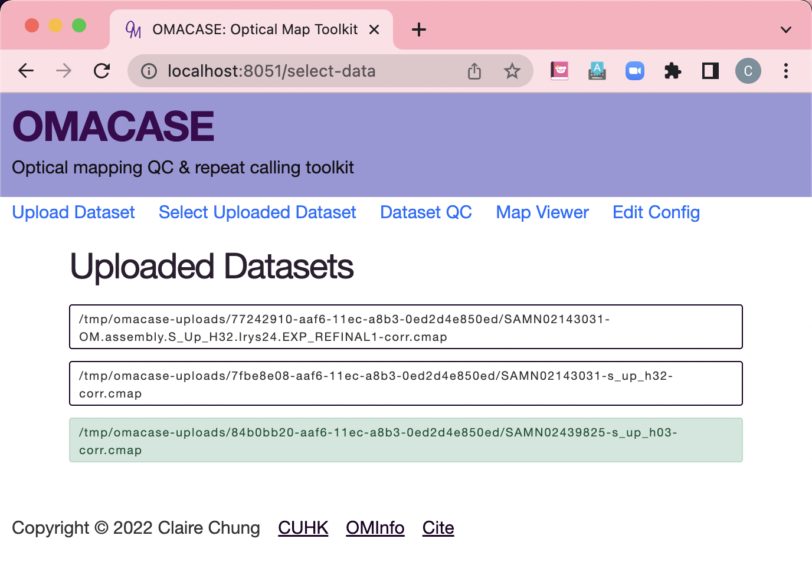

# Using the web UI

Starting the OMACASE web UI is as simple as `python3 -m omacase -m web`.
By default, the server runs at `localhost:8050`.
You can then type `localhost:8050` in the browser to access the OMACASE web UI.
The port can also be specified by adding a `-p` option, 
e.g. `python3 -m omacase -m web -p 8123`.

## Upload & select dataset for analysis

The first step in using the OMACASE web UI is to load the target dataset to study.
OMACASE is by default set to allow storage and reuse of datasets once loaded.
This minimizes the bandwidth and time needed for data transferral, 
such as for quality assessment of larger molecule files on a remote computer.

1. Go to the **"Upload Dataset"** tab. 
   Upload the file into the storage folder if it is not already present.
2. Go to the **"Select Uploaded Dataset"** tab. Select the file to analyze.

## Example screenshots of data loading
### Upload data page

### Uploading a file

### Selecting a file from stored datasets

